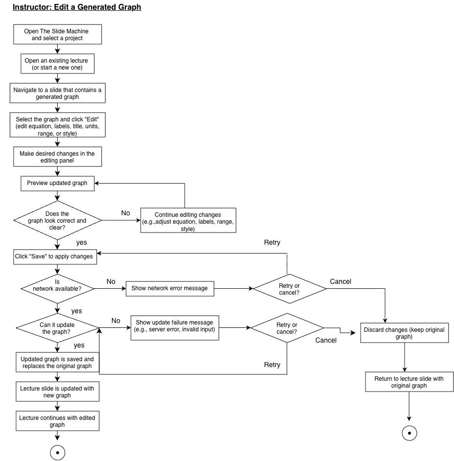
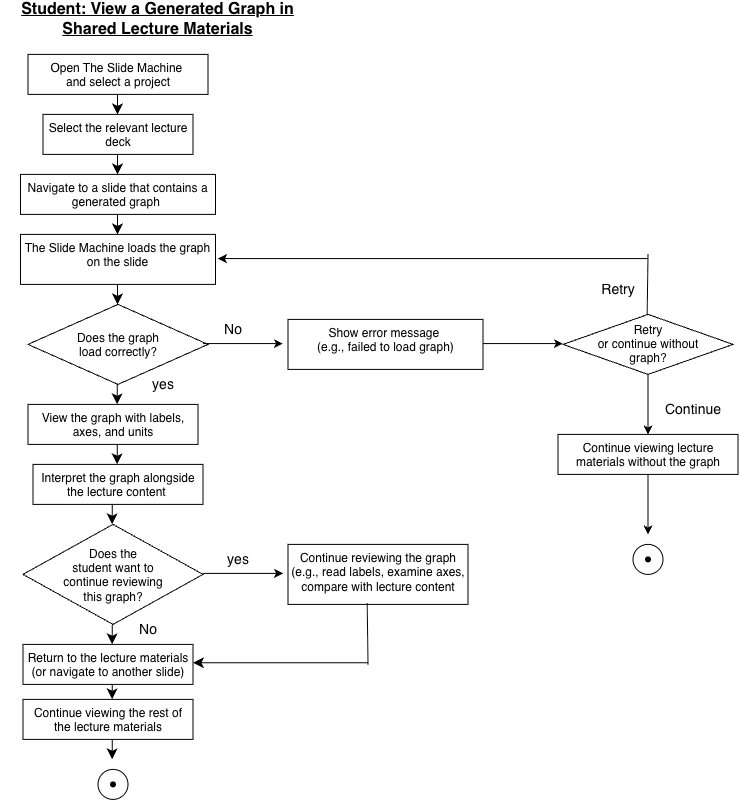
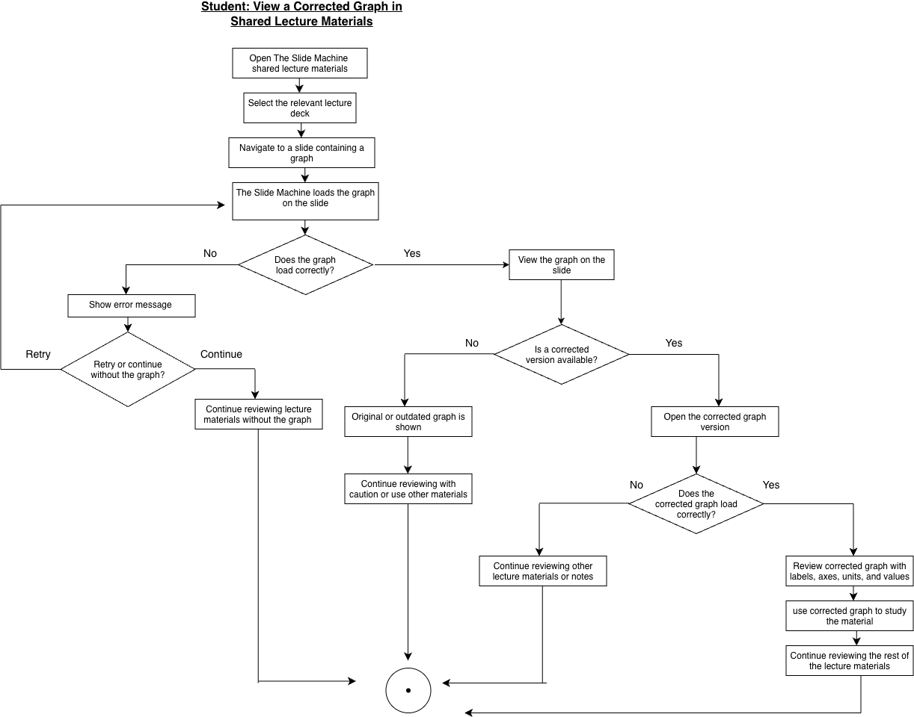

# Specification Phase Exercise

A little exercise to get started with the specification phase of the software development lifecycle. In this exercise, your team specifies a set of improvements and new features for [The Slide Machine](https://theslidemachine.com) — see the [instructions](instructions.md) for detail, and the [background](background.md) for an introduction to the software product you are tasked with extending.

## Team members

See instructions. Delete this line and replace with a list of the names of your team members, including links to each one's GitHub profile.

## Review of the Current Application

During hands-on testing of The Slide Machine with lectures covering physics, introductory Python programming, and mathematics, the following strengths, weaknesses, and gaps were observed:

1. **[Strength]** The system accurately generated simple mathematical expressions when they were stated verbally during a lecture.

2. **[Strength]** When the system correctly understood the direction of the lecture, it was sometimes able to generate relevant slides quickly enough to keep pace with the speaker.

3. **[Strength]** Incorrect or unnecessary generated content could be edited or removed, and unnecessary slides could be deleted while the lecture was still in progress.

4. **[Weakness]** Generated images and animations were sometimes inaccurate or did not correctly represent the concept being discussed.

5. **[Weakness]** The system sometimes misinterpreted the context or timing of spoken content. Incidental remarks, transitions, and references to future topics occasionally caused irrelevant or mistimed slides to be generated.

6. **[Weakness]** Slide generation was more predictable when the lecture followed a prepared structure, while natural deviations from that structure were more likely to result in irrelevant or mistimed content.

7. **[Weakness]** The system sometimes repeatedly changed or regenerated the same slide while the lecturer continued speaking, making the live presentation difficult to follow.

8. **[Weakness]** Summary and key-takeaway slides did not consistently summarize only the material covered in the lecture. In some cases, new or future topics were introduced instead.

9. **[Weakness]** Spoken programming content was not handled consistently. Code such as `print("Hello World")` was not reliably represented as code, programming keywords were not clearly distinguished from normal text, and unintended code such as `x = 10` was sometimes generated.

10. **[Weakness]** Live transcription was less reliable when speech was fast or when pronunciation or accent varied, causing the system to fall behind or misunderstand parts of the lecture.

11. **[Weakness]** Some automatically generated exit-ticket questions were inaccurate or did not correctly reflect the material covered during the lecture.

12. **[Gap]** The system could not generate an actual graph when explicitly requested; it instead showed generic images of parabola-like graphs.

13. **[Gap]** Text boxes could not be repositioned to adjust their distance from slide borders, limiting the lecturer's control over slide layout and spacing.

14. **[Gap]** The system did not appear to respond when the lecturer directly addressed it as "Slide Machine" and verbally requested an action during the lecture.

## Prior Art & Originality

See instructions. Delete this line and replace with a short statement of what your team checked (the project's Future Work and Open Questions, its roadmap, and its open issues and pull requests) and which parts of your proposal are original — new work not already specified, scheduled, or proposed by someone else.

## Stakeholders

We interviewed four stakeholders representing the two primary user types affected by our proposal: two instructors and two students. Partial names/pseudonyms are used in this public repository to protect participant privacy. Full names and contact information will be provided privately to the course administrators as required.

### Instructor Stakeholders

- **Instructor A** — ALevel physics teacher with experience teaching topics that regularly use graphs, including motion, forces, and relationships between physical quantities.
- **Instructor B** — ALevel mathematics teacher with experience teaching functions, coordinate graphs, transformations, and other visually represented mathematical concepts.

During the interviews, both instructors discussed their current teaching practices and then interacted with The Slide Machine. Particular attention was paid to how the application handled mathematical and scientific content that would normally benefit from a graph or chart.

#### Instructor Goals / Needs

1. **Accurate visual representation of concepts.** Instructors need graphs and charts to represent the same mathematical or scientific relationship they are explaining verbally.

2. **Clear axes, labels, scales, and units.** A generated graph needs enough context for students to understand what each axis and plotted value represents.

3. **Fast generation during a live lecture.** Visuals should appear quickly enough that instructors can continue teaching without interrupting the flow of the lecture.

4. **Ability to correct generated visuals.** Instructors need to be able to modify an equation, data value, range, label, or other graph property when the generated result does not match their intention.

5. **Support for different types of academic visuals.** Instructors may need function graphs, plotted data, line charts, bar charts, and other common visual representations depending on the subject being taught.

6. **Consistency between spoken explanation and displayed material.** Students should see a visual that accurately reflects what the instructor has just explained rather than an approximate or unrelated image.

#### Instructor Problems / Frustrations

1. **Incorrect graphs can mislead students.** A visual that does not accurately represent the equation or data being discussed may create more confusion than showing no graph at all.

2. **Generic images are not a substitute for actual graphs.** When a specific mathematical graph is required, an image that merely resembles the concept does not provide the precision needed for teaching.

3. **Creating or finding graphs during a lecture can interrupt teaching.** Switching to another application or manually preparing a graph can disrupt the flow of a live class.

4. **Lack of editing control reduces trust.** If an automatically generated graph is slightly wrong, instructors need a straightforward way to correct it rather than discard it completely.

5. **Missing labels or inappropriate scales can make otherwise correct visuals difficult to interpret.**

6. **Automatically generated content must remain understandable across different subjects.** A graph-generation feature should not assume that all instructors use the same notation, terminology, or type of data.

### Student Stakeholders

- **Student A** — Student with experience learning mathematics and science topics that involve equations, functions, and graphical representations.
- **Student B** — Student who regularly uses lecture slides and visual material when reviewing quantitative subjects.

Both students were asked about how they learn from lecture material, particularly when equations, numerical relationships, and graphs are involved. They also interacted with The Slide Machine and considered how automatically generated lecture visuals could affect their understanding.

#### Student Goals / Needs

1. **Visual connection between equations and their meaning.** Students want to see how a mathematical expression or scientific relationship behaves rather than only reading the equation.

2. **Graphs that match the instructor's explanation.** Students need the visual representation to correspond directly to the concept being discussed in class.

3. **Clearly labelled visual information.** Axes, units, values, titles, and other labels help students interpret graphs without guessing what they represent.

4. **Visuals that support later revision.** Students value having the same graphs and charts used during the lecture available in the shared lecture materials so they can review them when studying.

5. **Accurate plots and data.** Students need confidence that the graphs they use for revision are mathematically or scientifically correct.

6. **Simple, readable visuals.** Graphs should communicate the important relationship clearly without unnecessary visual clutter.

#### Student Problems / Frustrations

1. **Equations alone can be difficult to interpret.** A written expression may show the mathematical relationship without making its behaviour immediately understandable.

2. **Incorrect graphs can reinforce misunderstandings.** Students may assume that material shown on a lecture slide is correct and use it later when studying.

3. **Generic images provide little academic value when a precise graph is required.** A picture of a parabola, for example, does not necessarily show the function, scale, coordinates, or transformation being discussed.

4. **Unlabelled or poorly scaled graphs are difficult to interpret without additional explanation.**

5. **When an important visual is missing from the lecture deck, students may have difficulty reconstructing the instructor's explanation later.**

6. **Inconsistent visual representations can make it harder to connect spoken explanations, equations, and lecture notes.**

### Stakeholder Observation Summary

Across both user types, accurate visual representation emerged as an important need for quantitative lecture material. Instructors emphasized the need to present and correct graphs without interrupting the flow of a lecture, while students emphasized the value of visual representations for understanding and later revision.

During use of The Slide Machine, particular attention was given to requests for mathematical or scientific graphs. These observations, together with the stakeholder interviews, motivated further investigation of structured graph and chart support as a possible extension to the application.

## Product Vision Statement

Extend The Slide Machine with structured, editable graph and chart generation that allows instructors to turn spoken equations, data, and quantitative relationships into accurate, clearly labelled visuals during live lectures, while giving students clearer visual representations that remain available in the shared lecture materials for understanding and revision.

## User Requirements
### Instructor User Stories
1. As an instructor, I want The Slide Machine to generate a graph from an equation I say during lecture so that I can visually explain the relationship to my students.   
2. As an instructor, I want to generate charts from numerical data I describe aloud so that I can represent quantitative information without switching to another application.
3. As an instructor, I want generated graphs to include clearly labeled axes so that students know what each axis represents.
4. As an instructor, I want to specify units for graph axes so that the visual accurately represents the scientific or mathematical quantities I am discussing.
5. As an instructor, I want to adjust the range and scale of a generated graph so that I can focus on the portion that is relevant to my explanation.
6. As an instructor, I want to edit the equation or data used to generate a graph so that I can correct errors if The Slide Machine misinterprets what I said.
7. As an instructor, I want to edit graph labels, titles, and units so that I can correct or clarify the generated visual before using it in my lecture.
8. As an instructor, I want to choose between appropriate graph and chart types so that I can use the visual representation that best fits the material I am teaching.
9. As an instructor, I want generated graphs and charts to appear quickly during a live lecture so that creating a visual does not interrupt the flow of my teaching.
10. As an instructor, I want to review and correct a generated graph before relying on it in my lecture so that students are not shown inaccurate information.
11. As an instructor, I want corrected graphs to remain in the final shared lecture deck so that students can review the accurate version after class.

### Student User Stories 
1. As a student, I want to see a graph that corresponds to an equation discussed in class so that I can understand the equation visually.
2. As a student, I want graphs to match the instructor's spoken explanation so that I can connect what I hear with what I see on the slide.
3. As a student, I want graph axes to be clearly labeled so that I can understand what each variable represents.
4. As a student, I want units to be displayed on graphs when appropriate so that I can correctly interpret scientific and mathenatical quantities.
5. As a student, I want important values and plotted data to be clearly represented so that I can undertsand the relationship being discussed.
6. As a student, I want graphs and charts to use readable scales so that I can interpret the visual wihtout having to guess what the values mean.
7. As a student, I want generated graphs to be simple and easy to read so that I can understand them while also following the live lecture.
8. As a student, I want graphs used during the lecture to remain in the shared lecture materials so that I can review them later while studying.
9. As a student, I want corrected versions of inaccurate graphs to appear in the shared lecture materials so that I do not study from incorrect information.
10. As a student, I want equations and their corresponding graphs to appear together in the lecture material so that I can understand the connection between the mathematical expression and its visual behavior.
11. As a student, I want charts generated from lecture data to accurately represent the values discussed by the instructor so that I can trust the visuals when reviewing the material later.  

      
## Activity Diagrams
### Activity Diagram 1 — Instructor: Generate a Graph from a Spoken Equation

**User Story #1:**  
As an instructor, I want The Slide Machine to generate a graph from an equation I say during lecture so that I can visually explain the relationship to my students.

### Activity Diagram 2 — Instructor: Edit a Generated Graph

**User Story #7:**  
As an instructor, I want to edit graph labels, titles, and units so that I can correct or clarify the generated visual before using it in my lecture.

### Activity Diagram 3 — Student: View a Generated Graph in Shared Lecture Materials

**User Story #8:**  
As a student, I want graphs used during the lecture to remain in the shared lecture materials so that I can review them later while studying.

### Activity Diagram 4 — Student: View a Corrected Graph in Shared Lecture Materials

**User Story #9:**  
As a student, I want corrected versions of inaccurate graphs to appear in the shared lecture materials so that I do not study from incorrect information.

## Wireframes

See instructions. Delete this line and place your wireframe diagrams here, covering every new screen and every existing screen your proposal changes, for every type of user.

## Clickable Prototype

See instructions. Delete this line and place a publicly-accessible link to your clickable prototype here.

## Stakeholder Demo

See instructions. Delete this line and place a link to the deck The Slide Machine generated during your presentation here, after you have presented.

## Exit Ticket

See instructions. Delete this line and place a link to the exit-ticket quiz you generated from your demo deck and distributed to the class, along with a short note on what — if anything — you had to correct in the generated questions before publishing.
